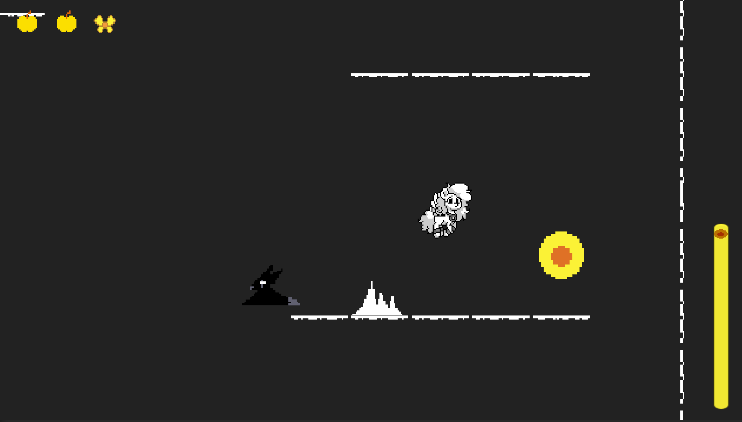

# Titlu Proiect: Last Hope

## Cuprins
- [Descriere](#Descriere)
- [Design-ul jocului](#Design-ul%20jocului)
- [Instrucțiuni de utilizare proiect Unity](#Instrucțiuni%20de%20utilizare%20proiect%20Unity)
- [Controale joc](#Controale%20joc)
- [Script-uri utilizate](#Script-uri%20utilizate)
- [Scene și Asset-uri](#Scene%20și%20Asset-uri)
- [Cum funcționează](#Cum%20funcționează)
- [Probleme / Limitări](#Probleme%20/%20Limitări)
- [Instrucțiuni de Build ale proiectului în Unity](#Instrucțiuni%20de%20Build%20ale%20proiectului%20în%20Unity)
- [Surse](#Surse)
- [Licență](#Licență)

---
## Descriere

**Last Hope** este un platformer 2D bazat pe un desen personal în care jucătorul trebuie să se ferească de creaturile din umbră, să strângă lumini ce oferă speranță și să supraviețuiască cât mai mult timp în temnița întunecată.

A fost creat folosind Unity 2022.3.62f1 pe Windows 10 pentru un curs de Licență intitulat „Proiect de Inginerie Matematică” din cadrul FSA, UNSTPB. 

Link GitHub: https://github.com/EnyaEithene/Guiding-Light-Win-

---
## Design-ul jocului
- **Scop**: Să strângă lumini pentru a avansa în temniță.
- **Mecanisme implementate**:
	- Agățarea, respectiv sărirea de pe pereți
	- Colectarea luminilor de diferite intensități
	- Acțiunea de dash prin inamici
	- Încărcarea unui nou nivel prin apăsarea unui buton
	- Generarea automată a inamicilor și luminilor, luminile având o durată de viață limitată
- **Cameră**: Cameră virtuală Cinemachine împreună cu un Confiner

---
## Instrucțiuni de utilizare proiect Unity
1. Clonează sau descarcă proiectul.
2. Deschide-l în Unity (2022.X sau mai nou).
3. Deschide MainScene.unity.
4. Asigură-te că dependențele sunt instalate prin Package Manager: Cinemachine, Input System, Unity UI.

---
## Controale joc

| Acțiune                | Tastă                       |
| ---------------------- | --------------------------- |
| Mișcare stânga-dreapta | Săgeți stânga-dreapta / A-D |
| Salt                   | Săgeată Sus / W             |
| Dash                   | Click-dreapta / Q           |
| Coborâre               | Săgeata Jos / S             |
| Avansare nivel         | E                           |
| Tragere în inamici     | Click-stânga                |

---
## Script-uri utilizate
### bullet.cs / PlayerShoot.cs
- „Gloanțele” pe care le trage jucătorul pentru a elimina inamicii
- Acțiunea de tragere a lor

### Collector.cs / Gem.cs / IItem.cs / healthItem.cs
- Sistem de colectare a obiectelor din nivel
- Lumini pentru a face progres în nivel
- Obiecte de recuperare a vieților pierdute

### Enemy.cs / LootItem.cs
- Comportamentul inamicilor, respectiv cât de tare atacă și câte vieți au
- Obiecte ce pot apărea la eliminarea lor

### GameController.cs / HoldToLoadLevel.cs
- Se ocupă de diferite evenimente din joc:
	- pierderea jocului
	- resetarea jocului
	- etc.
- Avansare la un nou nivel

### HealthUI.cs / PlayerHealth.cs
- Gestionează viețile jucătorului
- Afișare pe ecran al acestora

### ObjectSpawner.cs
- Apariția aleatoare a unui număr de obiecte, respectiv inamici în nivel

### PlayerMovement.cs
- Tipurile de mișcări pe care le poate face jucătorul

### StartMenuController
- Meniul de start al jocului

### Trap.cs
- Capcană de tip spini

---
## Scene și Asset-uri
- **Jucător**: Prefab cu animație creată folosind un sprite customizat pe website-ul [Pony Town](https://pony.town/character)
- **Tilemap**: Folosit pentru structura nivelelor
- **Lumini**: Prefab-uri cu collider + `Gem.cs`
- **Inamici**: Prefab cu șanse de apariție mai scăzută
- **Bară de progres**: Slider de tip UI actualizat folosind `GameController.cs`
- **Vieți jucător**: Șir de obiecte actualizat folosind `HealthUI.cs`

---
## Cum funcționează
- Jucătorul strânge lumini, fiecare lumină adunându-se la progresul nivelului
- Odată de progresul ajunge la 100, se poate avansa la următorul nivel ținând apăsat tasta `E`
- Luminile și inamicii apar în nivel dinamic
- Inamicii pot fi loviți cu „gloanțe” pentru a obține mai multe lumini sau mere ce regenerează viața pierdută
- Confiner-ul camerei virtuale menține imaginea strict asupra nivelului

---
## Probleme / Limitări
- Tile-urile de platforme nu sunt realizate dintr-un capăt într-altul; trebuie refăcute
- Omorârea inamicilor nu fac să apară mere nici când sunt setate ca având șanse de apariție 100%
- Sărirea de pe pereți este „lipicioasă”
- Atârnarea de pereți are animația instabilă

---
## Instrucțiuni de Build ale proiectului în Unity
1. Dați pe meniul `File > Build Settings`.
2. Adăugați scena curentă (asigurați-vă că ambele scene se află în listă).
3. Alegeți platforma (de exemplu Windows).
4. Apăsați `Build` și alegeți folder-ul pentru salvare.

---
## Surse
- **Cod**: [„FULL Platformer Tutorial Series - Unity 2D” de Game Code Library](https://www.youtube.com/playlist?list=PLaaFfzxy_80EWnrTHyUkkIy6mJrhwGYN0)
- **Artă**: Unity Assets/ Personalizat, [EnyaEithene](https://github.com/EnyaEithene) folosind aplicația [LibreSprite](https://libresprite.github.io/#!/)
- **Unelte**: Unity, C#, Cinemachine

---
## Licență

Acest proiect este licențiat sub [Licența MIT](LICENSE).  
A fost realizat în scop educațional, ca parte a unui curs universitar, și este bazat parțial pe un tutorial public de pe YouTube. Toate resursele grafice personalizate (precum sprite-urile realizate personal) rămân proprietatea intelectuală a creatorilor lor.
